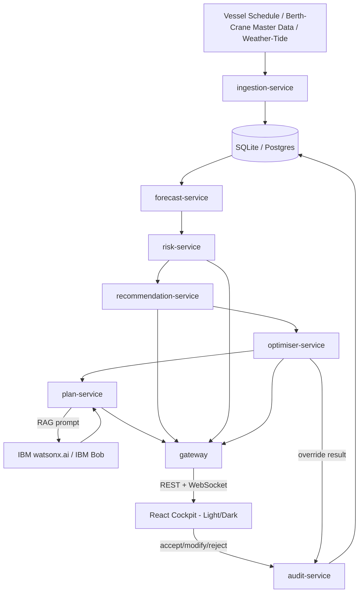

# Architecture

## System Diagram

## Component Table

| Component | Technology | Responsibility |
|---|---|---|
| `ingestion-service` | Python / FastAPI | Synthetic vessel/berth data generation, normalization into a common schema |
| `master-data-service` | Python / FastAPI | Berth/crane/yard/user CRUD, RBAC-scoped |
| `forecast-service` | Python, Prophet, XGBoost/LightGBM | ETA correction, berth occupancy forecast, anchorage queue, cascading delay simulation |
| `risk-service` | Python | Risk tiering, SHAP-based explanations, confidence intervals |
| `recommendation-service` | Python | Diversion / slow-steam / re-sequencing suggestions, cost-impact estimation |
| `optimiser-service` | Python, OR-Tools/PuLP (MILP) | Berth & crane assignment under hard constraints, override validation |
| `plan-service` | Python, IBM watsonx.ai (RAG) | 72h shift briefing generation, handover notes, alerts |
| `chat-service` | Python, IBM watsonx.ai (RAG) | Natural-language, grounded Q&A |
| `audit-service` | Python | Immutable log of every recommendation and human decision |
| `gateway` | FastAPI | Auth, routing, rate limiting, WebSocket fan-out |
| Frontend | React, Tailwind + Carbon tokens | Supervisor cockpit — heatmap, Gantt, recommendation feed, chat, light/dark theming |
| Database | SQLite (dev) / PostgreSQL (production path) | Structured storage for vessels, berths, forecasts, recommendations, audit log |

## End-to-End Data Flow
1. `ingestion-service` generates/ingests vessel, berth, yard, and weather data and normalizes it into the shared schema.
2. `forecast-service` computes corrected ETAs and 72-hour berth occupancy probabilities.
3. `risk-service` converts those forecasts into a per-berth-hour risk tier with an explanation and confidence interval.
4. `recommendation-service` proposes fixes for elevated-risk berth-hours, each with a cost/time estimate.
5. `optimiser-service` computes (and re-computes, on new events) a constraint-valid berth/crane assignment; a supervisor may override it, with violations flagged live.
6. `plan-service` grounds a watsonx.ai prompt in the current risk scores and optimiser output to generate a plain-language 72-hour briefing; `chat-service` answers ad-hoc questions the same way.
7. Every AI output and every human accept/modify/reject decision is written to `audit-service`'s immutable log.
8. The `gateway` exposes all of this as REST + WebSocket to the React cockpit, which renders it in a light- or dark-themed view depending on user preference.

## Security Notes
Full detail in `docs/security.md` (carried over from the project's engineering doc set). Summary: RBAC enforced server-side on every endpoint, TLS everywhere, no secrets in source control, structured input validation on every service boundary, and explicit prompt-injection defenses on the two LLM-touching services (`plan-service`, `chat-service`) — untrusted data is never allowed to override the system prompt, and generated output is validated against real data before being shown.

## Scalability Notes
The service boundaries above are drawn so each one is independently deployable — for the hackathon they run as lightweight local processes (see `docs/setup-guide.md`), but the same boundaries map directly onto separate containers behind Kubernetes/OpenShift for a production deployment, with SQLite swapped for PostgreSQL/Db2 and the synthetic ingestion swapped for a real AIS feed via Kafka/IBM Event Streams. None of that swap requires re-architecting — only reconfiguring the `ingestion-service` and datastore connection.
