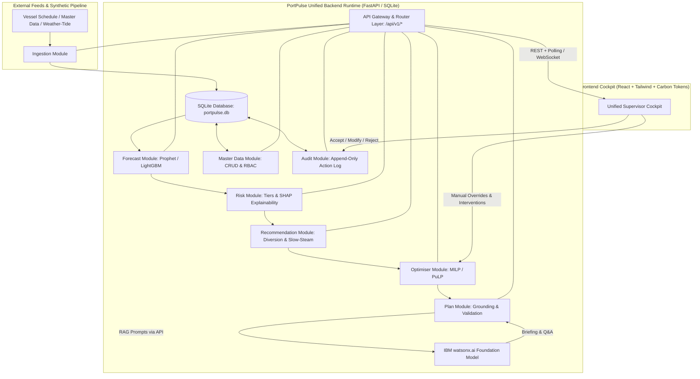

# Architecture — PortPulse

## System Architecture (Hackathon Local Architecture & Production Path)

To adhere strictly to development machine hardware constraints (Intel i3, 8GB RAM), the backend services are modularized as clean, independent Python routers running within a single lightweight FastAPI process, backed by SQLite. This ensures sub-2GB memory consumption while preserving strict microservice boundaries that can be separated into standalone containers on OpenShift/Kubernetes for production deployment.

### System Diagram

## Component Table

| Module / Component | Local Dev Implementation | Production Scaling Path | Responsibility |
|---|---|---|---|
| `ingestion-service` | Python FastAPI router | Dedicated container / Kafka consumer | Synthetic data generation (50 vessels, 10 berths), normalization into shared schema |
| `master-data-service` | Python FastAPI router | Dedicated container | Berth/crane/yard/user CRUD with server-side RBAC |
| `forecast-service` | Python, Prophet, LightGBM | Dedicated container + GPU node | ETA correction, 72h berth occupancy probability, anchorage queue forecasting |
| `risk-service` | Python FastAPI router | Dedicated container | Risk tier classification (Green/Amber/Red), SHAP-based feature importance, uncertainty intervals |
| `recommendation-service`| Python FastAPI router | Dedicated container | Diversion, slow-steam, priority re-sequencing suggestions with cost/impact metrics |
| `optimiser-service` | Python, PuLP / OR-Tools | Dedicated container | MILP solver for berth & crane assignment, constraint guardrails |
| `plan-service` | Python, watsonx.ai API client | Dedicated container | RAG-grounded 72h shift briefing and handover generation |
| `chat-service` | Python, watsonx.ai API client | Dedicated container | Conversational natural-language Q&A grounded strictly in current live state |
| `audit-service` | Python FastAPI router | Event-sourced container | Immutable append-only log of AI recommendations and human decisions |
| `frontend` | React 18 (Vite), Tailwind CSS | Nginx static container / CDN | Supervisor cockpit: heatmap, Gantt, recommendation feed, light/dark theming |
| `database` | SQLite (`portpulse.db`) | IBM Db2 / PostgreSQL | Relational storage for all entities, forecasts, and audit events |

## End-to-End Operational Pipeline
1. **Ingestion:** Schedule and asset data is generated or ingested, normalized, and committed to the database.
2. **Forecast & Risk:** Vessel ETAs are corrected; berth occupancy probabilities are computed across a rolling 72-hour window; risk tiers and SHAP feature contributions are assigned.
3. **Recommendation & Optimisation:** For red/amber risk tiers, candidate interventions (diversion, slow-steaming) are calculated with cost/time trade-offs. The MILP engine generates a constraint-valid berth/crane schedule.
4. **Generative Synthesis:** Operational metrics and schedules are injected into structured prompts to generate human-readable shift briefings via IBM watsonx.ai.
5. **Human Decision & Audit:** Operators review recommendations in the Cockpit, choosing to Accept, Modify, or Reject, or execute manual overrides. All actions are logged with correlation IDs.
